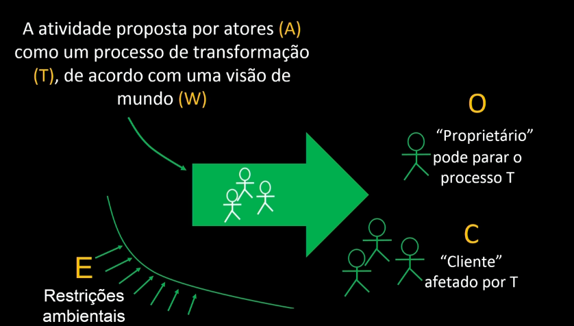
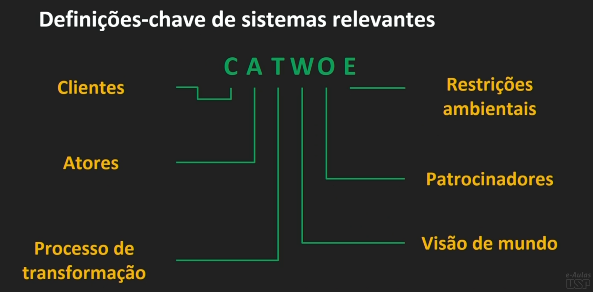
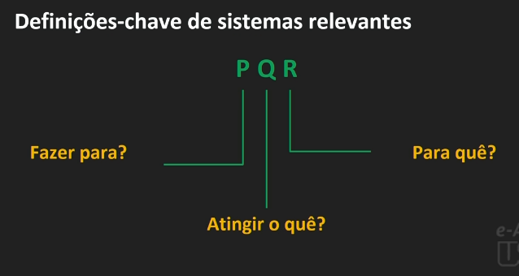
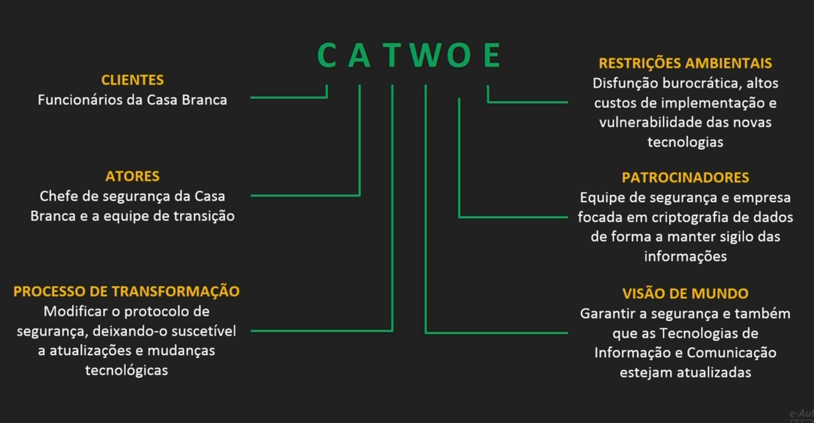
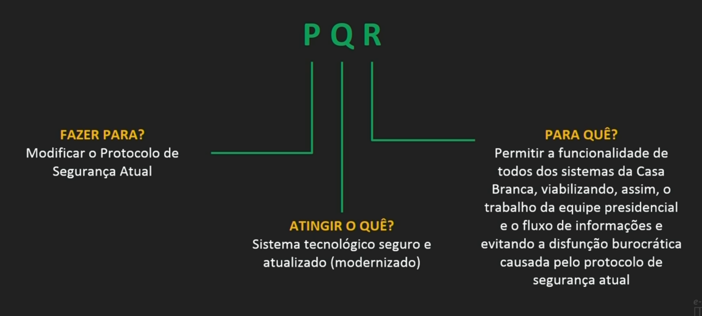

# Definições-chave 

## Tabela de conteúdos

- [Definições-chave](#definições-chave)
  - [Tabela de conteúdos](#tabela-de-conteúdos)
  - [Antes da Aula](#antes-da-aula)
    - [Definição de Elementos](#definição-de-elementos)
    - [Video 1](#video-1)
      - [Visão não integrada da empresa](#visão-não-integrada-da-empresa)
      - [Visão integrada da empresa](#visão-integrada-da-empresa)
      - [Implantação de um sistema ERP](#implantação-de-um-sistema-erp)
      - [Como Implantar](#como-implantar)
      - [Problema de Implantação](#problema-de-implantação)
      - [Como solucionar o problema do sistema não ser usado](#como-solucionar-o-problema-do-sistema-não-ser-usado)
      - [Problema ao implantar um sistema ERP](#problema-ao-implantar-um-sistema-erp)
    - [Video 2](#video-2)
      - [CATWOE](#catwoe)
      - [PQR](#pqr)
      - [Exemplo Casa Branca](#exemplo-casa-branca)
        - [Situação Problemática Expressa](#situação-problemática-expressa)
        - [Exemplo - CATWOE](#exemplo---catwoe)
        - [Exemplo - PQR](#exemplo---pqr)
  - [Durante a Aula](#durante-a-aula)
    - [Caso NFTs Têm outro lado benéfico](#caso-nfts-têm-outro-lado-benéfico)
      - [Caso NFTs: CATWOE](#caso-nfts-catwoe)
      - [Caso NFTs: PQR](#caso-nfts-pqr)

## Antes da Aula

### Definição de Elementos

- Problema estruturado é o ponto de partida.
- O pensamento sistêmico é essencial.
- Uso do CATWOE e PQR para definir sistemas.
- CATWOE: Cliente, Atores, Transformação, Visão, Proprietário, Restrições.
- PQR: Fazer P usando Q para alcançar R.

|  Método   |                   Questões a serem respondidas |
| :-------: | ---------------------------------------------: |
|  Catwoe   |                                       Clientes |
|  cAtwoe   |                                           Ator |
|  caTwoe   |                      Processo de Transformação |
|  catWoe   |                Visão de Mundo (Weltanschauung) |
|  catwOe   | Patrocinadores ou "donos" do processo (Owners) |
|  catwoE   |            Restrições ambientais (Environment) |
|    PQR    |               Fazer P por um Q para atingir R. |
| Critérios |              Eficência, eficácia e efetividade |

### Video 1

Abordagem dos **Sistemas de atividades humanas** (SAH), conceito fundamental para entender que mesmo em situações onde o contexto técnico domina, o contexto humano é essencial para o sucesso de um projeto.

#### Visão não integrada da empresa

Existem muitas planilhas//sistemas diferentes para cada setor da empresa, o que dificulta a comunicação entre os setores e a visão integrada da empresa.

#### Visão integrada da empresa

Todas os setores da empresa estão integrados em um único sistema ERP, o que facilita a comunicação entre os setores e a visão integrada da empresa.

> **Nota:** A visão de mundo de quem está gerenciando o sistema afeta diretamente a forma como o sistema.

#### Implantação de um sistema ERP

Depende da mobilização de diferentes profissionais, existem 3 pontos de vista diferentes para a implantação de um sistema ERP:

- **Visão Empresa cliente:** Há necessidade de um Analista de Sistemas e um Engenheiro de Produção

- **Visão Empresa Software:** Há necessidade de um Profissional de TI Especializado na ferramenta

- **Visão Empresa Consultoria:** Há necessidade de um Consultor de implantação para fazer o orçamento

Cada um destes 3 pontos de vista possuem uma visão diferente do processo de implantação:

- **Empresa cliente**: Deseja Efetividade
- **Empresa Software**: Deseja Robustez/Integração
- **Empresa Consultoria**: Deseja Orçamento

A visão dos 3 devem ser integradas para que o sistema seja implantado com sucesso.

#### Como Implantar

- 1 Fase: Uma equipe é definida
- 2 Fase: A equipe define o processo de implantação
- 3 Fase: Treinamento dos usuários
- 4 Fase: Implantação do sistema

#### Problema de Implantação

Apesar disso, existe um 4º ponto de vista, o do usuário, que deve ser levado em consideração para que o sistema seja implantado com sucesso. Com o tempo, o uso do sistema decai devido ao fato de que o usuario não participou do processo de implantação, o que faz com que ele não se sinta parte do sistema.

#### Como solucionar o problema do sistema não ser usado

Qual seria a visão dinâmica do processo de implamantação?

- 1 Fase: Uma equipe é definida (Incluindo pessoas de diferentes setores da empresa)
- 2 Fase: A equipe define o processo de implantação
- 3 Fase: Treinamento dos usuários
- 4 Fase: Implantação do sistema
- 5 Fase: Evolução do sistema (A alta gerência deve estar envolvida)

> A empresa deve ter um sistema de informação ou ela deve ser o sistema de informação

Essa ultima 5º Fase garante a valorização do sistema, o que faz a empresa como um todo vai assimile o sistema de tal forma que tudo que se faz na empresa passa pelo sistema de informação.

#### Problema ao implantar um sistema ERP

Ao ser implantado inicia-se uma situação problématica que é a evolução do sistema, que deve ser feita de forma que o sistema não se torne obsoleto.

> **Nota:** Um problema de natureza administrativa sempre antecede um problema de natureza técnica.

### Video 2

Abordagem da **3º Etapa** da **metodologia de sistemas soft** que é a **Definição chaves de sistemas relevantes**.

Para isso usamos 2 processos mnemônicos: **CATWOE** e **PQR**.

#### CATWOE

Uma Atividade proposta por **Atores (A)** como um processo de **transformação (T)**, de acordo com uma **visão de mundo (W)**

Isso é feito para **Clientes (C)**, que são **proprietários (O)** do processo, levando em consideração as **restrições (E)** do ambiente.

> Essas definições preliminares do **CATWOE** dão uma boa ideia de como que as principais variaveis que cercam o problema de natureza administrativa articulam-se entre si

#### PQR

Fazer para **P**, Atingir o que **Q** e para quê **R**?

Com a conjulgação do processo CATWOE com o PQR permitem que a gente tenha uma boa ideia de como diferentes elementos se articulam para as definições chaves de sistema relevante.

#### Exemplo Casa Branca

##### Situação Problemática Expressa

Como Alterar o protocolo de Segurança da Casa Branca para viabilizar o trabalho cotidiano com a utilização de Tecnologia de Informação e Comunicação?

##### Exemplo - CATWOE

##### Exemplo - PQR

## Durante a Aula

- A aula tratará sobre o CATWOE e PQR

### Caso NFTs Têm outro lado benéfico

Situação problemática expressa da aula anterior:

Como promover o processo de descentralização de empresas utilizando blockchain ?

> Nessa fase é importante identificar como os diferentes elementos interagem.

- Sistemas de Atividades Humanas (SAH) antecede a própria solução de blockchain.
  - São as atividades das pessoas que determinarão a efetividade de solução
  
#### Caso NFTs: CATWOE

- C: empresas / usuários
- A: desenvolvedores da solução
- T: adotar uma estrutura de registro em blockchain para a autenticidade e exclusividade de NFTs
- W: garantir a segurança das transações, a partir de contratos inteligentes, sem autoridades centrais
- O: responsável(s) pelo contrato inteligente
- E: há uma comprensão limitada do conjunto de ações que os proprietários de NFTs podem exercer e a infraestrutura necessária, a pesar de estar disponível, é cara.

#### Caso NFTs: PQR

Implantar a estrutura blockchain **P** para facilitar transações **Q** sem a necessidade de autoridades centrais **R**.
