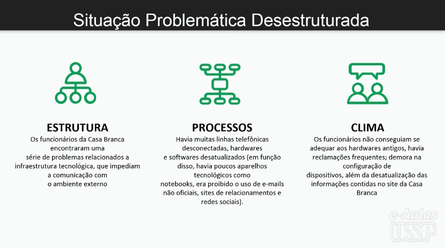
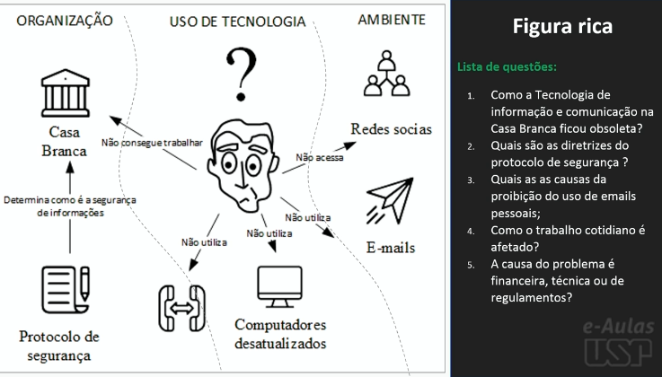

# Introdução SSM/Situação problemática

## Tabela de conteúdos

- [Introdução SSM/Situação problemática](#introdução-ssmsituação-problemática)
  - [Tabela de conteúdos](#tabela-de-conteúdos)
  - [Antes da Aula](#antes-da-aula)
    - [Definição de Elementos](#definição-de-elementos)
    - [Videos](#videos)
      - [Video 1](#video-1)
      - [Video 2](#video-2)
      - [Video 3](#video-3)
      - [Video 4](#video-4)
  - [Aula](#aula)
    - [Situação problemática](#situação-problemática)
      - [Destruturada](#destruturada)
      - [Expressa](#expressa)
    - [Casos](#casos)
    - [Glossário](#glossário)
    - [Situação problemática desestruturada](#situação-problemática-desestruturada)
      - [Estrutura da situação](#estrutura-da-situação)
      - [Processo da situação](#processo-da-situação)
      - [Clima da situação](#clima-da-situação)
      - [Figuras ricas](#figuras-ricas)
    - [Situação problemática expressa](#situação-problemática-expressa)

## Antes da Aula

### Definição de Elementos

- Metodologia de sistemas soft aborda problemas administrativos complexos.

- Problemas são chamados de "situações problemáticas desestruturadas".

- Esses problemas são considerados "mal comportados" devido a **visões divergentes** das pessoas envolvidas.

- A metodologia utiliza **sete etapas** para lidar com esses problemas e propor melhorias.

- Primeiras duas etapas: identificação da situação problemática desestruturada e sua transformação em uma situação problemática estruturada.

- Compreender o contexto por meio da análise da estrutura, processo e clima da situação.

- Representação visual dos principais elementos para melhor compreensão.

| Elemento              | Definição                                                                                                      |
| --------------------- | -------------------------------------------------------------------------------------------------------------- |
| Estrutura da situação | Contexto físico e organizacional no qual a situação está inserida                                              |
| Processo da situação  | Revela como as coisas funcionam                                                                                |
| Clima da situação     | Visa compreender as atitudes dos indivíduos em relação às suas atividades, inseridas em uma organização social |
| Figuras ricas         | Representar através de um desenho os relacionamentos entre os elementos apresentados                           |

### Videos

#### Video 1

A 1º questão a metodologia de sistema soft tenta diferenciar é a diferença entre a abordagem Hard x Soft

- Hard: Surgiu junto da teoria de Sistemas, olha para um determinado sistema, vê os objetivos deste sistema e então tenta projetar um sistema que atenda a estes objetivos, ignorando o contexto em que o sistema está inserido.

- Soft: O observador entende todo o contexto, ele tem um modelo de sistema já elaborado e então ele projeta um sistema que atenda a este modelo.

Comparação

- Hard: ignora questões do mundo
- Soft: considera questões do mundo

Nunca há uma solução correta para um problema de natureza administrativa mas há melhorias que podem ser feitas.

Como fazer isso?

Ciclo de aprendizagem Kolb:

1. Experiência concreta (vivência)
2. Observação reflexiva (observação)
3. Conceitualização abstrata (pensar)
4. Experimentação ativa (agir)

Essas 4 etapas permitem que o problema de natureza administrativa seja compreendido

A partir deste modelo de Kolb surgiu o modelo de 7 etapas da metodologia de sistemas soft

1. Situação problemática desestruturada (vivência)
2. Situação problemática expressa (observação)
3. Definições-chave de conceitos relevantes (pensar)
4. Modelos conceituais (pensar)
5. Comparação de modelos conceituais com a realidade (pensar)
6. Mudanças possíveis e desejáveis (agir)
7. Ações para melhorar a situação problemática (agir)

#### Video 2

Discussão com alunos da disciplina sobre a Metodoogia de Sistemas Soft

#### Video 3

Apresentação da primeira etapa da metodologia de sistemas soft

1º Etapa: Situação problemática desestruturada

Identificamos a estrutura, processo e clima da situação.

A partir da identificação desses elementos, elaboramos uma figura rica

Uma vez caracterizado isso nos da um contexto

2 º Etapa: Situação problemática expressa

A partir da figura rica, elaboramos um texto que descreve a situação, ponto de partida para sair do mundo real e ir para o mundo conceitual

Exemplo:

Figura rica elaborada:

#### Video 4

Abordagem das figuras ricas

O objetivo das figuras ricas é capturar a situação problemática que caracteriza a estruturação dos problemas

Figuras ricas permitem identificar:

- oportunidades
- forças dinâmicas
- ambiente
- tendências socias, políticas
- ameaçãs
- tendêncais econômicas
- tecnologias

A ideia da figura rica é que ela seja desenvolvida naturalmente

## Aula

### Situação problemática

Um problema de natureza administrativa é chamado de Situação problemática

#### Destruturada

- Estrutura da situação
- Processo da situação
- Clima da situação
- Figura rica

#### Expressa

- Declaração da situação problemática expressa através de uma questão

### Casos

1. Descentralização à vista
2. Hyperledger

### Glossário

- **NFT:** Token não fungível é um símbolo eletrônico criado em uma plataforma blockchain para representar algum bem considerado único.
- **DAO:** Organização autônoma descentralizada é uma entidade governada por uma comunidade online cujas regras são definidas por contratos inteligentes.
- **Blockchain:** É um livro razão imutável e compartilhado que facilita as transações e o controle de ativos em uma rede de negócios
  - Ativo pode ser tangível ou intangível

### Situação problemática desestruturada

#### Estrutura da situação
  
- Web 3.0 trata de operações descentralizadas e seguras, não necessita de grandes empresas para intermediação.
- As autoridades centrais e estrutura top-down serão desnecessárias
  
#### Processo da situação

- NFTs tem a capacidade de remover as autoridades centrais de maneira transparente e segura e rastreável.
- DMV registro de automóveis
- Crossmint permite a compra de NFTs com cartão de crédito

#### Clima da situação

- Desconhecimento sobre o uso da tecnologia
- Pessimismo grande por não conseguirem prever o que poderá ocorrer

#### Figuras ricas

Como representar uma figura rica:

<!-- TODO: Adicionar imagem -->

**Note:** Não há um padrão para representar mas há uma estrutura recomendada

Dividir em 3 partes:

- Organização
- Uso da tecnologia
- Ambiente

Responder Questões:

Aqui depende da semântica da situação problemática, mas o padrão de perguntas a serem feitas deve seguir o padrão 3W (What, How, Why)

- What: O que é a situação problemática? (Definir conceitos iniciais)
- How: Como a situação problemática pode impactar a organização? (Definir questões de impacto no problema em questão)
- Why: Por que a situação problemática é importante? (Definir questões de importância dos conceitos inicias em âmbito da organização)

### Situação problemática expressa

Como promover o processo de descentralização de empresas utilizando blockchain?

- Ciclo de aprendizado de Kolb
- Visão de mundo
