# Titulo

## Tabela de conteúdos

- [Titulo](#titulo)
  - [Tabela de conteúdos](#tabela-de-conteúdos)
  - [Antes da Aula](#antes-da-aula)
    - [Definição de Elementos](#definição-de-elementos)
    - [Video 1](#video-1)
      - [Passos para elaboração do modelo conceitual](#passos-para-elaboração-do-modelo-conceitual)
        - [Passo 1 - Defina as entidades](#passo-1---defina-as-entidades)
        - [Passo 2 - Defina critérios de desempenho](#passo-2---defina-critérios-de-desempenho)
        - [Passo 3 - Defina as dependências mútuas](#passo-3---defina-as-dependências-mútuas)
        - [Passo 4 - Adicione a envoltória para delimitar o modelo](#passo-4---adicione-a-envoltória-para-delimitar-o-modelo)
        - [Passo 5 - Adicione o monitoramento e controle](#passo-5---adicione-o-monitoramento-e-controle)
        - [Passo 6 - Adicicione as dependências com os demais elementos](#passo-6---adicicione-as-dependências-com-os-demais-elementos)
      - [5º Etapa do MSS - Compare o modelo conceitual e a situação problemática expressa](#5º-etapa-do-mss---compare-o-modelo-conceitual-e-a-situação-problemática-expressa)
      - [Exemplo Casa Branca](#exemplo-casa-branca)
        - [Situação Problemática Expressa](#situação-problemática-expressa)
        - [Exemplo - CATWOE](#exemplo---catwoe)
        - [Exemplo - PQR](#exemplo---pqr)
        - [Exemplo - Modelo Conceitual: Entidades](#exemplo---modelo-conceitual-entidades)
        - [Exemplo - Modelo Conceitual: Critérios](#exemplo---modelo-conceitual-critérios)
        - [Exemplo - Modelo Conceitual: Finalizado](#exemplo---modelo-conceitual-finalizado)
        - [Exemplo - Modelo Conceitual: Comparação](#exemplo---modelo-conceitual-comparação)
  - [Aula](#aula)

## Antes da Aula

### Definição de Elementos

|               Elementos               |                   Definição                   |
| :-----------------------------------: | :-------------------------------------------: |
|     Entiddade a ser transformada      | Relativo aos elementos de entrada no sistema  |
| Entidade em processo de transformação |          Relativo ao processo em si           |
|  Entidade em estado de transformação  |        Relativo aos elementos de sáida        |
|            Visão de mundo             | indica por qual perspectiva se dará a mudança |
|       Processo de transformação       |       Explicita o que deve ser alterado       |

- O modelo conceitual concretiza um processo de transformação por meio de atividades interdependentes.
- A delimitação do sistema é crucial, definindo atividades e suas dependências com uma envoltória externa.
- As entradas e saídas do sistema são representadas por setas.
- Critérios de desempenho são externos à envoltória e relacionados às saídas do sistema.
- O modelo adota uma abordagem de pensamento sistêmico, considerando sistemas abertos que interagem com o ambiente.
- Ele reúne componentes administrativos em atividades para formar um sistema com propósitos.
- Compara-se com a situação problemática para entender "o que", "como", "quem" em cada atividade, com comentários.
- Essas definições ajudam a avaliar melhorias culturalmente possíveis e sistemicamente desejáveis na próxima etapa.

### Video 1

Abordagem da **4º Etapa** da **metodologia de sistemas soft** que é o **Modelo Conceitual**.

Este modelo materializa uma primeira visão de como se daria o processo de transformação identificado na etapa de conceitos chave.

Partindo então do CATWOE e PQR para elaborar o modelo conceitual

#### Passos para elaboração do modelo conceitual

##### Passo 1 - Defina as entidades

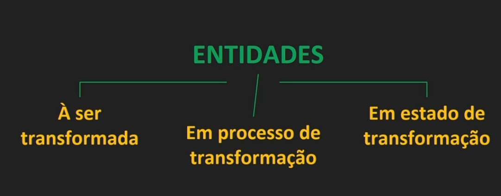

##### Passo 2 - Defina critérios de desempenho

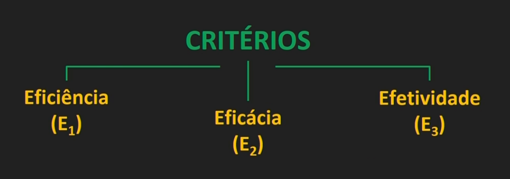

##### Passo 3 - Defina as dependências mútuas

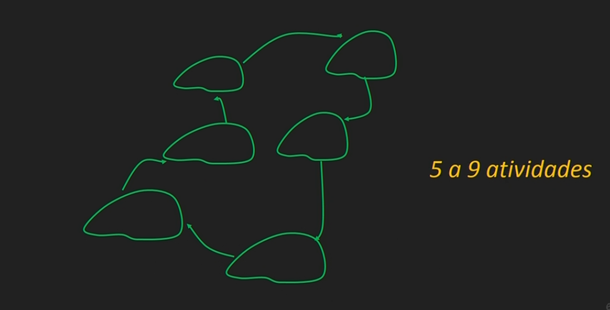

##### Passo 4 - Adicione a envoltória para delimitar o modelo

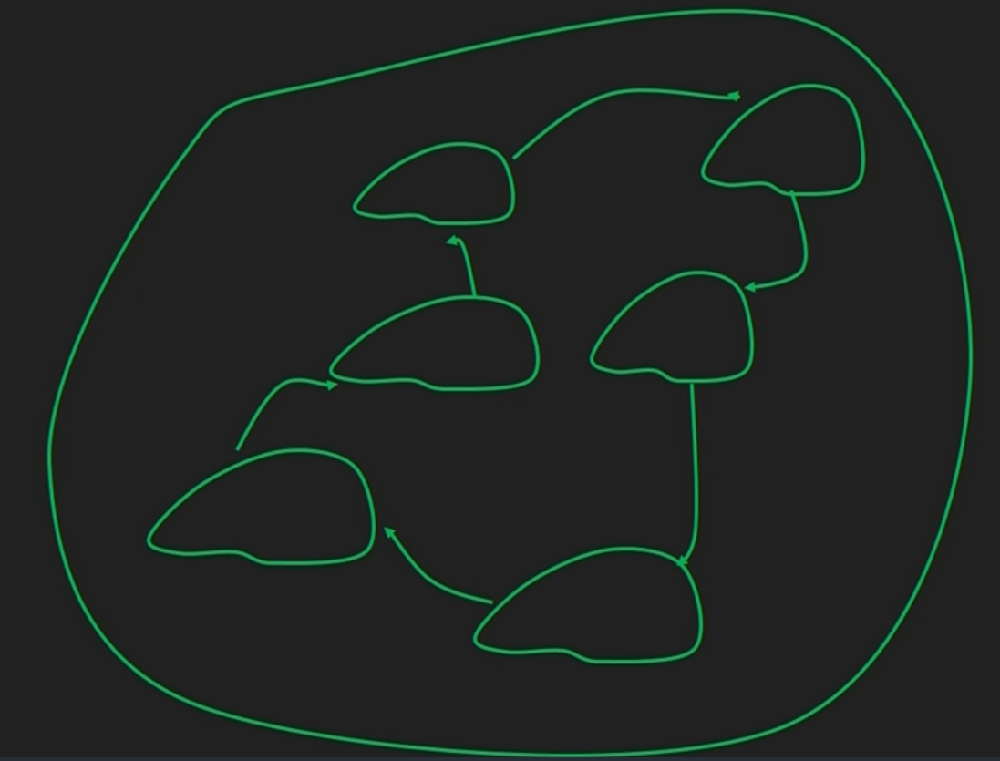

##### Passo 5 - Adicione o monitoramento e controle

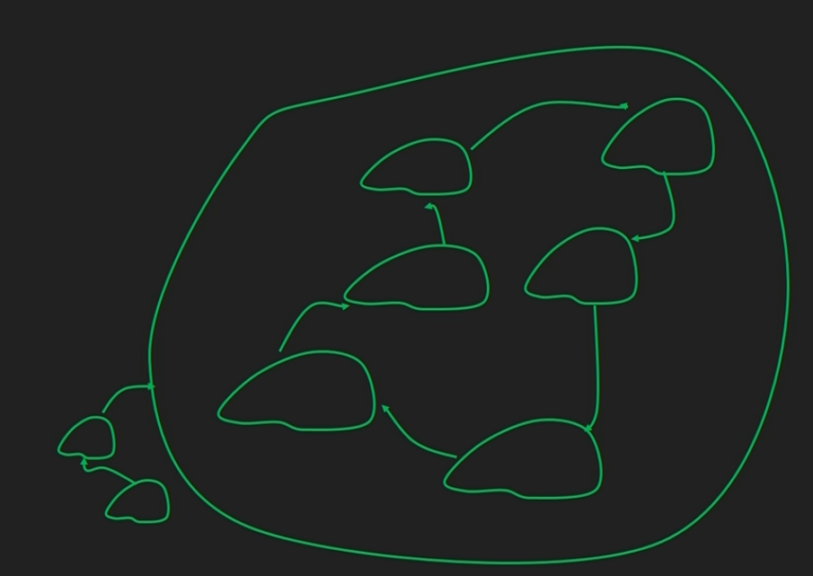

##### Passo 6 - Adicicione as dependências com os demais elementos

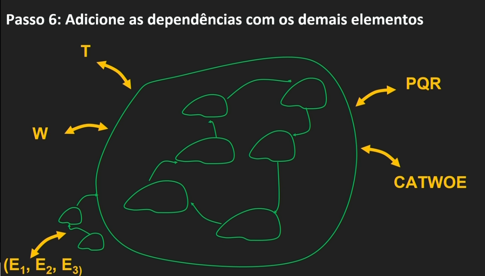

#### 5º Etapa do MSS - Compare o modelo conceitual e a situação problemática expressa

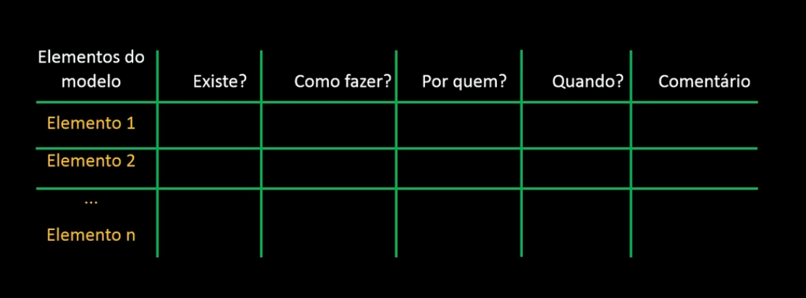

#### Exemplo Casa Branca

##### Situação Problemática Expressa

Como Alterar o protocolo de Segurança da Casa Branca para viabilizar o trabalho cotidiano com a utilização de Tecnologia de Informação e Comunicação?

##### Exemplo - CATWOE

##### Exemplo - PQR

##### Exemplo - Modelo Conceitual: Entidades

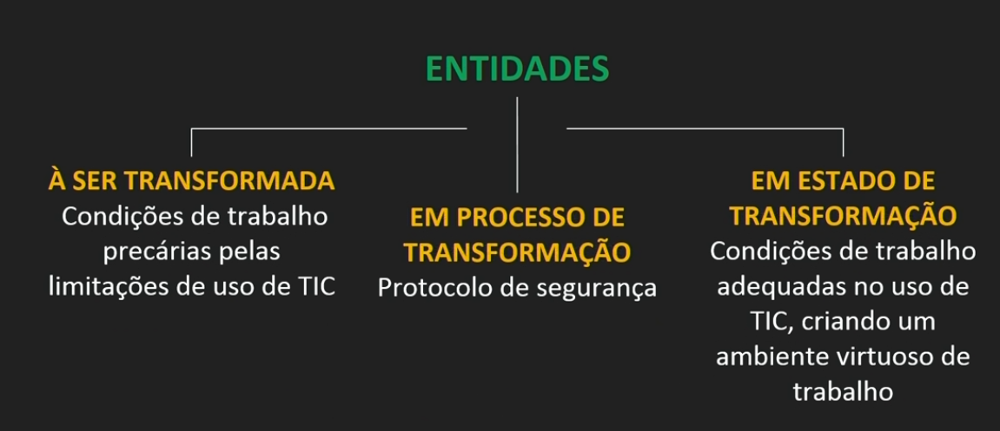

##### Exemplo - Modelo Conceitual: Critérios

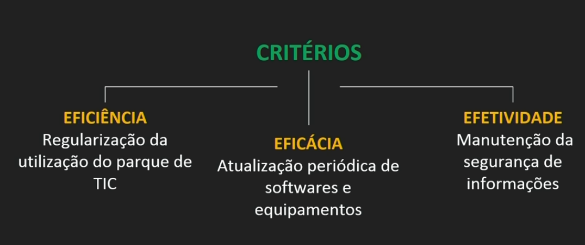

##### Exemplo - Modelo Conceitual: Finalizado

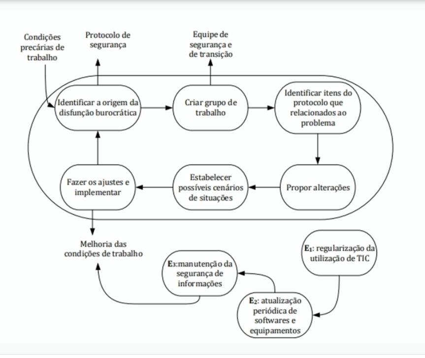

##### Exemplo - Modelo Conceitual: Comparação

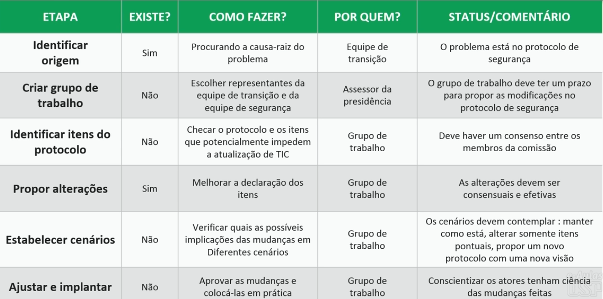

## Aula
